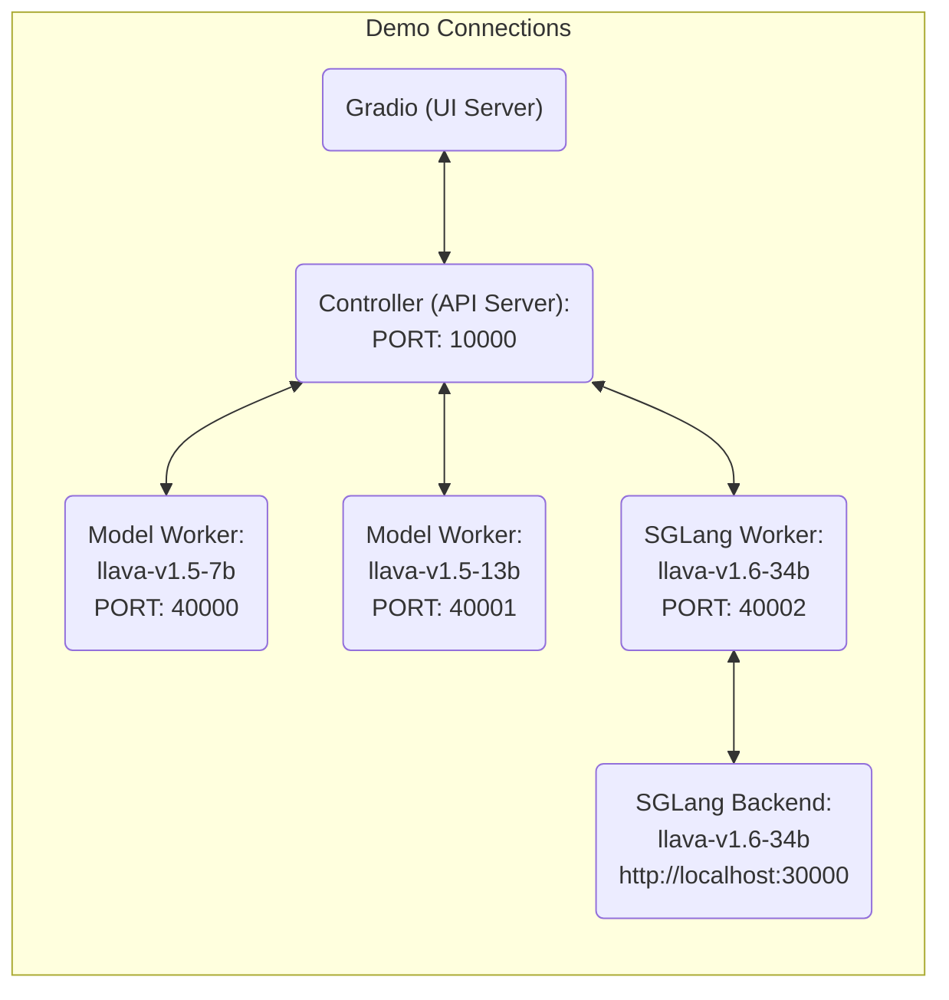

#  AdaptPrune

This is the implementation of the paper *Multi-Cue Adaptive Visual Token Pruning for Large Vision-Language Models*

As the computational needs of Large Vision-Language Models (LVLMs) increase, visual token pruning has proven effective in improving inference speed and memory efficiency. Traditional pruning methods in LVLMs predominantly focus on attention scores to determine token relevance, overlooking critical aspects such as spatial position and token similarity. To this end, we introduce AdaptPrune, a novel plug-and-play training-free pruning method that builds on conventional attention-based pruning by integrating spatial distance and token similarity with an adaptive NMS approach. Our method is based on several observed phenomena in large models: the positional bias in the model's image attention and the redundancy of token information ignored by previous approaches. By integrating attention, spatial, and similarity information, our approach ensures a comprehensive evaluation of token importance and substantially refines the pruning decisions. Our method has been extensively tested across various LVLMs and benchmarks, confirming its robustness and adaptability. The results demonstrate that AdaptPrune consistently outperforms existing methods across various pruning ratios.

The code is based on [LLaVA-1.5](https://github.com/haotian-liu/LLaVA) and [FastV](https://github.com/pkunlp-icler/FastV).


## Install


1. Clone this repository and navigate to LLaVA folder
```bash
git clone https://github.com/bzluan/AdaptPrune.git
cd LLaVA
```

2. Install Package
```Shell
conda create -n llava python=3.10 -y
conda activate llava
pip install --upgrade pip  # enable PEP 660 support
pip install -e .
```

### Single Sample Test

```Shell
python llava/eval/run_llava.py \
--model-path liuhaotian/llava-v1.5-7b \
--image-file images/llava_logo.png \
--query "Describe the image in detail." \
--temperature 0.0 
```

### Quick Start With HuggingFace

<details>
<summary>Example Code</summary>

```Python
from llava.model.builder import load_pretrained_model
from llava.mm_utils import get_model_name_from_path
from llava.eval.run_llava import eval_model

model_path = "liuhaotian/llava-v1.5-7b"

tokenizer, model, image_processor, context_len = load_pretrained_model(
    model_path=model_path,
    model_base=None,
    model_name=get_model_name_from_path(model_path)
)
```

Check out the details wth the `load_pretrained_model` function in `llava/model/builder.py`.

You can also use the `eval_model` function in `llava/eval/run_llava.py` to get the output easily. By doing so, you can use this code on Colab directly after downloading this repository.

``` python
model_path = "liuhaotian/llava-v1.5-7b"
prompt = "What are the things I should be cautious about when I visit here?"
image_file = "https://llava-vl.github.io/static/images/view.jpg"

args = type('Args', (), {
    "model_path": model_path,
    "model_base": None,
    "model_name": get_model_name_from_path(model_path),
    "query": prompt,
    "conv_mode": None,
    "image_file": image_file,
    "sep": ",",
    "temperature": 0,
    "top_p": None,
    "num_beams": 1,
    "max_new_tokens": 512
})()

eval_model(args)
```
</details>


## LLaVA Weights
Please check out our [Model Zoo](https://github.com/haotian-liu/LLaVA/blob/main/docs/MODEL_ZOO.md) for all public LLaVA checkpoints, and the instructions of how to use the weights.


## Evaluation

In LLaVA-1.5, we evaluate models on a diverse set of 12 benchmarks. To ensure the reproducibility, we evaluate the models with greedy decoding. We do not evaluate using beam search to make the inference process consistent with the chat demo of real-time outputs.

See [Evaluation.md](https://github.com/haotian-liu/LLaVA/blob/main/docs/Evaluation.md).

### GPT-assisted Evaluation

Our GPT-assisted evaluation pipeline for multimodal modeling is provided for a comprehensive understanding of the capabilities of vision-language models.  Please see our paper for more details.

1. Generate LLaVA responses

```Shell
python model_vqa.py \
    --model-path ./checkpoints/LLaVA-13B-v0 \
    --question-file \
    playground/data/coco2014_val_qa_eval/qa90_questions.jsonl \
    --image-folder \
    /path/to/coco2014_val \
    --answers-file \
    /path/to/answer-file-our.jsonl
```

2. Evaluate the generated responses.  In our case, [`answer-file-ref.jsonl`](./playground/data/coco2014_val_qa_eval/qa90_gpt4_answer.jsonl) is the response generated by text-only GPT-4 (0314), with the context captions/boxes provided.

```Shell
OPENAI_API_KEY="sk-***********************************" python llava/eval/eval_gpt_review_visual.py \
    --question playground/data/coco2014_val_qa_eval/qa90_questions.jsonl \
    --context llava/eval/table/caps_boxes_coco2014_val_80.jsonl \
    --answer-list \
    /path/to/answer-file-ref.jsonl \
    /path/to/answer-file-our.jsonl \
    --rule llava/eval/table/rule.json \
    --output /path/to/review.json
```

3. Summarize the evaluation results

```Shell
python summarize_gpt_review.py
```


## Demo

### Gradio Web UI

To launch a Gradio demo locally, please run the following commands one by one. If you plan to launch multiple model workers to compare between different checkpoints, you only need to launch the controller and the web server *ONCE*.



#### Launch a controller
```Shell
python -m llava.serve.controller --host 0.0.0.0 --port 10000
```

#### Launch a gradio web server.
```Shell
python -m llava.serve.gradio_web_server --controller http://localhost:10000 --model-list-mode reload
```
You just launched the Gradio web interface. Now, you can open the web interface with the URL printed on the screen. You may notice that there is no model in the model list. Do not worry, as we have not launched any model worker yet. It will be automatically updated when you launch a model worker.

#### Launch a SGLang worker

This is the recommended way to serve LLaVA model with high throughput, and you need to install SGLang first. Note that currently `4-bit` quantization is not supported yet on SGLang-LLaVA, and if you have limited GPU VRAM, please check out model worker with [quantization](https://github.com/haotian-liu/LLaVA?tab=readme-ov-file#launch-a-model-worker-4-bit-8-bit-inference-quantized).

```Shell
pip install "sglang[all]"
```

You'll first launch a SGLang backend worker which will execute the models on GPUs. Remember the `--port` you've set and you'll use that later.

```Shell
# Single GPU
CUDA_VISIBLE_DEVICES=0 python3 -m sglang.launch_server --model-path liuhaotian/llava-v1.5-7b --tokenizer-path llava-hf/llava-1.5-7b-hf --port 30000

# Multiple GPUs with tensor parallel
CUDA_VISIBLE_DEVICES=0,1 python3 -m sglang.launch_server --model-path liuhaotian/llava-v1.5-13b --tokenizer-path llava-hf/llava-1.5-13b-hf --port 30000 --tp 2
```

Tokenizers (temporary): `llava-hf/llava-1.5-7b-hf`, `llava-hf/llava-1.5-13b-hf`, `liuhaotian/llava-v1.6-34b-tokenizer`.

You'll then launch a LLaVA-SGLang worker that will communicate between LLaVA controller and SGLang backend to route the requests. Set `--sgl-endpoint` to `http://127.0.0.1:port` where `port` is the one you just set (default: 30000).

```Shell
python -m llava.serve.sglang_worker --host 0.0.0.0 --controller http://localhost:10000 --port 40000 --worker http://localhost:40000 --sgl-endpoint http://127.0.0.1:30000
```

#### Launch a model worker

This is the actual *worker* that performs the inference on the GPU.  Each worker is responsible for a single model specified in `--model-path`.

```Shell
python -m llava.serve.model_worker --host 0.0.0.0 --controller http://localhost:10000 --port 40000 --worker http://localhost:40000 --model-path liuhaotian/llava-v1.5-13b
```
Wait until the process finishes loading the model and you see "Uvicorn running on ...".  Now, refresh your Gradio web UI, and you will see the model you just launched in the model list.

You can launch as many workers as you want, and compare between different model checkpoints in the same Gradio interface. Please keep the `--controller` the same, and modify the `--port` and `--worker` to a different port number for each worker.
```Shell
python -m llava.serve.model_worker --host 0.0.0.0 --controller http://localhost:10000 --port <different from 40000, say 40001> --worker http://localhost:<change accordingly, i.e. 40001> --model-path <ckpt2>
```

If you are using an Apple device with an M1 or M2 chip, you can specify the mps device by using the `--device` flag: `--device mps`.

#### Launch a model worker (Multiple GPUs, when GPU VRAM <= 24GB)

If the VRAM of your GPU is less than 24GB (e.g., RTX 3090, RTX 4090, etc.), you may try running it with multiple GPUs. Our latest code base will automatically try to use multiple GPUs if you have more than one GPU. You can specify which GPUs to use with `CUDA_VISIBLE_DEVICES`. Below is an example of running with the first two GPUs.

```Shell
CUDA_VISIBLE_DEVICES=0,1 python -m llava.serve.model_worker --host 0.0.0.0 --controller http://localhost:10000 --port 40000 --worker http://localhost:40000 --model-path liuhaotian/llava-v1.5-13b
```

#### Launch a model worker (4-bit, 8-bit inference, quantized)

You can launch the model worker with quantized bits (4-bit, 8-bit), which allows you to run the inference with reduced GPU memory footprint, potentially allowing you to run on a GPU with as few as 12GB VRAM. Note that inference with quantized bits may not be as accurate as the full-precision model. Simply append `--load-4bit` or `--load-8bit` to the **model worker** command that you are executing. Below is an example of running with 4-bit quantization.

```Shell
python -m llava.serve.model_worker --host 0.0.0.0 --controller http://localhost:10000 --port 40000 --worker http://localhost:40000 --model-path liuhaotian/llava-v1.5-13b --load-4bit
```

#### Launch a model worker (LoRA weights, unmerged)

You can launch the model worker with LoRA weights, without merging them with the base checkpoint, to save disk space. There will be additional loading time, while the inference speed is the same as the merged checkpoints. Unmerged LoRA checkpoints do not have `lora-merge` in the model name, and are usually much smaller (less than 1GB) than the merged checkpoints (13G for 7B, and 25G for 13B).

To load unmerged LoRA weights, you simply need to pass an additional argument `--model-base`, which is the base LLM that is used to train the LoRA weights. You can check the base LLM of each LoRA weights in the [model zoo](https://github.com/haotian-liu/LLaVA/blob/main/docs/MODEL_ZOO.md).

```Shell
python -m llava.serve.model_worker --host 0.0.0.0 --controller http://localhost:10000 --port 40000 --worker http://localhost:40000 --model-path liuhaotian/llava-v1-0719-336px-lora-vicuna-13b-v1.3 --model-base lmsys/vicuna-13b-v1.3
```

### CLI Inference

Chat about images using LLaVA without the need of Gradio interface. It also supports multiple GPUs, 4-bit and 8-bit quantized inference. With 4-bit quantization, for our LLaVA-1.5-7B, it uses less than 8GB VRAM on a single GPU.

```Shell
python -m llava.serve.cli \
    --model-path liuhaotian/llava-v1.5-7b \
    --image-file "https://llava-vl.github.io/static/images/view.jpg" \
    --load-4bit
```


